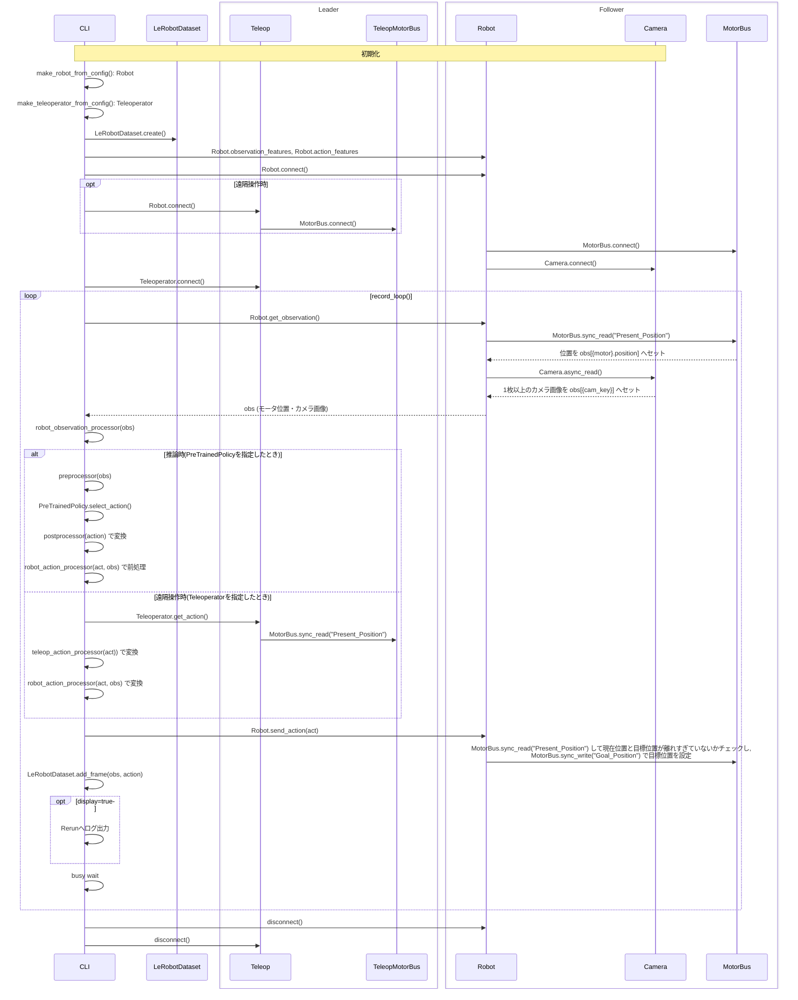

# LeRobotの主なスクリプトでのI/Fの使われ方

[scripts/](https://github.com/huggingface/lerobot/tree/5c8dd883be7518a18fcee33a06418ea13026f8bf/src/lerobot/scripts) には実機のセットアップや動作記録や学習・推論を行うためのコマンドが用意されている.

`Robot`, `TeleOperator`, `MotorBus` クラスがI/Fとして提供されており、実機固有の処理はこのクラスの実装として `robots/`, `teleoperators/` 以下に用意されている.
[SO-101](https://huggingface.co/docs/lerobot/so101) を例として、コマンド毎にI/Fの使われ方を確認する.

- セットアップ `lerobot_setup_motors`
    - Robot(フォロワー), Teleoperator(リーダー) それぞれで行う
- キャリブレーション `lerobot_calibrate`
    - Robot(フォロワー), Teleoperator(リーダー) それぞれで行う
    - フォロワーとリーダーにIDを指定する
- 動作記録/推論 `lerobot_record`
    - 動作記録
        - Teleoperator: リーダー
        - Robot: リーダーの動きに基づいて, フォロワーを遠隔操作する
    - 推論
        - PreTrainedPolicy: 学習済みのVLAモデル
        - Robot: VLAモデルの出力に基づいて, フォロワーを制御する

I/Fの実装手順は [Bring Your Own Hardware](https://huggingface.co/docs/lerobot/integrate_hardware) も併せて参照してください.

## セットアップ [`scripts/lerobot_setup_motors.py`](https://github.com/huggingface/lerobot/blob/5c8dd883be7518a18fcee33a06418ea13026f8bf/src/lerobot/scripts/lerobot_setup_motors.py)

- `Robot`
    - `setup_motors()`: 各モーター(`Motor`)のセットアップをする
- `TeleOperator`
    - `setup_motors()`: 同上
- `MotorBus`
    - `setup_motor()`: モーターのID, ボーレートを設定する

単純なのでシーケンス図は省略.

## キャリブレーション [`scripts/lerobot_calibrate.py`](https://github.com/huggingface/lerobot/blob/5c8dd883be7518a18fcee33a06418ea13026f8bf/src/lerobot/scripts/lerobot_calibrate.py)

- `Robot`
    - `connect()`
        - `configure()`: (SO-101の場合)制御モードや位置制御のPIDゲイン等を書き込む
            - NOTE: SO-101 Followerは位置制御でPD制御をしている (cf. [blog](https://tech-blog.abeja.asia/entry/so101-motor-control-202508#:~:text=%E6%9B%B8%E3%81%8D%E8%BE%BC%E3%82%93%E3%81%A7-,%E3%81%84%E3%82%8B%E3%81%8B,-STS3215%E3%82%B5%E3%83%BC%E3%83%9C%E3%83%A2%E3%83%BC%E3%82%BF%E3%83%BC))
    - `calibrate()`
- `TeleOperator`
    - `connect()`
    - `calibrate()`
- `MotorBus`
    - `connect()`
    - `disconnect()`
    - `write()`: 初期位置、可動範囲が書き込まれる

単純なのでシーケンス図は省略.

## 遠隔操作/推論 [`scripts/lerobot_record.py`](https://github.com/huggingface/lerobot/blob/5c8dd883be7518a18fcee33a06418ea13026f8bf/src/lerobot/scripts/lerobot_record.py)

- `Robot`
    - `observation_features()`
    - `action_features()`
    - `connect()`
        - `is_connected()`
    - `get_observation()`
    - `send_action()`
- `TeleOperator`
    - `connect()`
    - `get_action()`
    - `disconnect()`
- `MotorBus`
    - `connect()`
    - `disconnect()`

